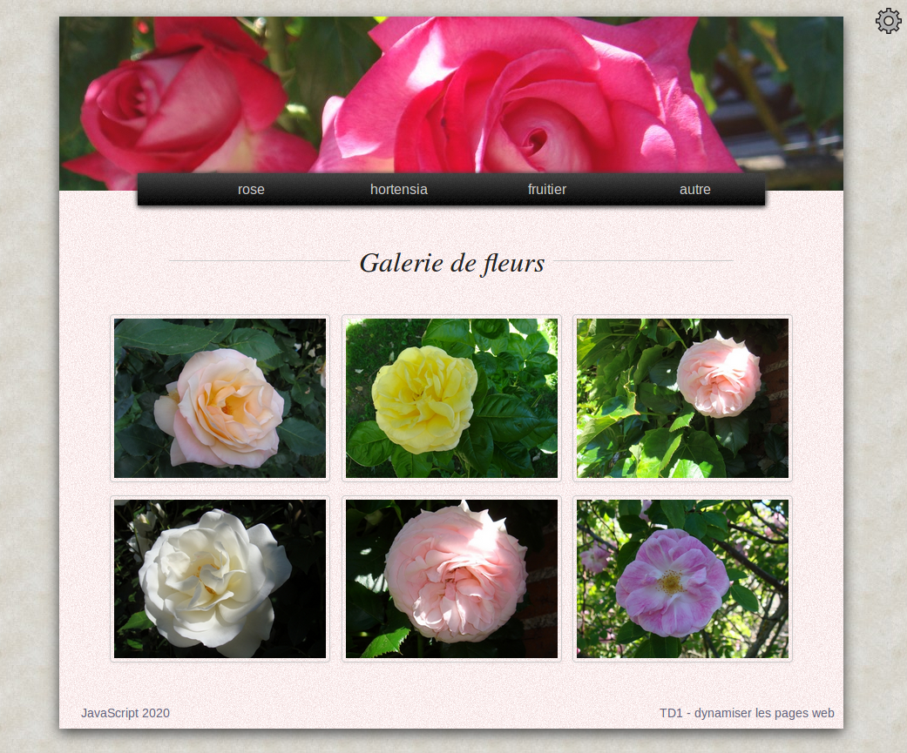

#  Prog web client riche - JavaScript

### IUT Montpellier-Sète – Département Informatique

## TD1
#### _Thème : dynamiser une page web_

Cliquez sur le lien ci-dessous pour faire, dans un dossier public_html/JS/TD1, votre fork privé du TD1 (**attention, pas de fork à la main !**):

https://classroom.github.com/a/3S6hMQt6

<!-- La version [PDF](ressources/td1.pdf) du TD. -->

## Introduction

Vos TD et projets de S1 (Conception Doc) vous ont appris à créer des sites web statiques, où les pages ne varient pas. Leur seul aspect "dynamique" était apporté par le css qui permettait des effets (_media queries_, transitions, etc).

En S3 vous avez appris à réellement dynamiser vos sites web en utilisant des appels au serveur web, avec des pages web construites par le serveur, en fonction de données recueillies sur la base de données ou par le biais de formulaires, et au moyen du langage PHP.

L’aspect dynamique de ces sites tient donc au fait que le serveur web construit la page sur demande (en fonction de l’utilisateur, des données d’un formulaire, etc). La page construite est donc fonction des circonstances, et c’est ce qui lui donne son caractère dynamique.

JavaScript permet de rendre dynamique une page web par l’utilisation de scripts, en réponse à des sollicitations côté client. Par exemple, des événements comme un clic de souris, une action au clavier, etc. Ici l’aspect dynamique est indépendant d’un appel serveur.

Dans certains cas, il peut être excessif de faire des appels permanents au serveur. En effet, une requête HTTP, génération de page PHP puis réponse HTTP prend du temps et des ressources informatiques, alors il est toujours mieux de s'en passer. Dans ce TD1 vous allez devoir modifier une page web qui pour le moment est en partie remplie via PHP, par des appels exagérés au serveur web.

Créez dans votre `public_html` un dossier `JS/TD`. C'est ce dossier qui accueillera le dépôt local en lien avec votre fork du TD1. Il est nécessaire que ce dépôt local soit dans votre `public_html` car le fichier `index.php` aura besoin d'un serveur web qui produira la page web bien construite.

<!-- Dans ce TD1, vous commencez à coder en JavaScript, sans cours préalable. Pas d’inquiétude, vous avez déjà un passé de prog objet, et même s’il faut se méfier de pas mal de choses intuitives avec ce langage, cela ne vous empêchera pas de faire vos premiers pas en JavaScript ! -->

## Exercice 1 - mécanisme client serveur

1. Appelez la page **index.php?fleur=rose** et expliquez le rôle de chaque instruction PHP de cette page (lignes 1 à 12, lignes 26 et 30, lignes 48 à 55).

<p align="center">
   
 </p>

2. En cliquant sur un des 4 items du menu, on fait une requête http au serveur, en lui passant en GET une valeur de fleur. Expliquez ce qui est actualisé sur la page quand on clique sur un item du menu.

## Exercice 2 - dynamiser le menu

1. Excluez tous les appels au serveur dans les liens du menu en remplaçant les `href="index.php?fleur=…"` par des `href="#"`. Vérifiez que le menu n’agit plus (ne lance plus de requête http).

2. Excluez de la partie PHP initiale (lignes 1 à 12) les lignes qui affectent une valeur à la variable `$fleur`.

3. Réactualisez la page web. Expliquez ce que vous constatez.

4. Pour corriger l’erreur, modifiez le contenu de la balise html `<div class='galerie'>` pour que par défaut elle affiche les roses, en remplaçant les évocations au PHP par ce qu’il faut.

5. Modifiez les balises `<a>` du menu pour les transformer ainsi :

   ```html
   <nav>
     <ul>
       <li><a href="#" onclick="adapterGalerie('rose');">rose</a></li>
       <li><a href="#" onclick="adapterGalerie('hortensia');">hortensia</a></li>
       <li><a href="#" onclick="adapterGalerie('fruitier');">fruitier</a></li>
       <li><a href="#" onclick="adapterGalerie('autre');">autre</a></li>
     </ul>
   </nav>
   ```

6. Ouvrez l’examinateur d’élément, menu « console » (F12), rafraîchissez la page, cliquez sur un item du menu et expliquez le message d’erreur qui apparaît.

   L’attribut `onclick` des balises `<a>` a pour valeur une chaîne   de caractères qui évoque l’exécution d’une fonction `adapterGalerie` avec un paramètre propre à chaque balise `<a>`.

   Cet attribut `onclick` permet un appel à un script JavaScript quand le lien est cliqué.

7. Juste avant la balise `</body>`, ajoutez le code suivant, et vérifiez que l’erreur précédente ne se produit plus.

   ```html
   <script type="text/javascript">
       function adapterGalerie(nom) {
           // à compléter
       }
   </script>
   ```

8. Essayez, à la place du commentaire `// à compléter`, les divers codes suivants, et décrivez ce qu’ils font :

   ```javascript
   console.log("bonjour de la part du menu !");
   console.log(nom);
   ```

9. On souhaite essayer le code suivant :

   ```html
   <script type="text/javascript">
     function adapterGalerie(nom) {
       for(let i = 1; i <= 6; i++) {
         const image = document.getElementById('fleur' + i);
         image.src = 'img/fleurs/' + nom + '/' + nom + i + '.jpg';
		 // ou avec la syntaxe `` qui permet le remplacement de variables
		 // image.src = `img/fleurs/${nom}/${nom}${i}.jpg`
       }
     }
   </script>
   ```

   Avant de l'essayer, d'après vous :

   + Que renvoie `document.getElementById('fleur' + i)` ?

   + Que fait `image.src = …` ?

   Copiez le nouveau code de `adapterGalerie`, puis vérifiez vos  réponses par l’inspecteur d’éléments après les clics sur les  items du menu.

   Vous prendrez le temps d'inspecter les images et de constater que les attributs `src` ont été adaptés.

10. Au survol d’une image de fleur, un titre s’affiche, car l’attribut `title` a été renseigné. Mais si on passe des roses à une autre catégorie de fleurs, on voit que le script n’a pas actualisé ce `title`. Corrigez le script en complétant la fonction `adapterGalerie` (inspirez-vous de la commande `image.src = …`) et vérifiez que le `title` est devenu dynamique.

11. Si une image n’est pas trouvée par le serveur, l’attribut `alt` joue son rôle et affiche un texte de remplacement à l’image. Vérifiez ce rôle en changeant le nom de certains fichiers images (par exemple renommez l'image `rose1.jpg` en `roseUn.jpg`) et réactualisez la page (`CTRL` `F5` par exemple)

    Observez ce qui se passe au niveau des attributs `alt` quand on choisit les différents items du menu. Ils sont encore statiques...

    Corrigez le script pour que les attributs `alt` soient construits comme ceux des roses : "hortensia1", "fruitier2" etc. Vérifiez le bon fonctionnement du script puis redonnez leur nom d’origine aux images modifiées.


## Exercice 3 - dynamiser la bannière

On va maintenant dynamiser la bannière. Pour le moment, l'image est choisie au hasard parmi 6 possibles, lors de la requête initiale, grâce à une variable PHP. Modifiez la bannière en incorporant toutes les images de cette façon :

```html
<div id="banniere">
  
  
  
  
  
  
</div>
```

Supprimez aussi les dernières lignes PHP en début de fichier.

La nouvelle structure html de la bannière montre qu’il y a 6 images, dont une de classe « visible » et 5 de classe « cachee ».

Derrière ces deux classes il y a une valeur différente de l’opacité de l’image (0 pour cachée et 1 pour visible, voir le css). Ces images sont superposées (à l'aide d'une propriété CSS `position:absolute`).

Vous allez créer deux effets différents de succession d’images.

1. Créez, dans la partie `<script>`, après le code de `adapterGalerie(nom)`, une fonction `cacher(im)` qui cache l’image `im` passée en paramètre. Pour cela vous pourrez :
    - retirer la classe `visible` à l’image `im`
    - ajouter la classe `cachee` à l’image `im`

   Aide :
    - `im.classList` désigne la liste de classes attribuées à `im`
    - `im.classList.add('nom_classe')` ajoute la classe `nom_classe` à `im`
    - `im.classList.remove('nom_classe')` la lui retire


2. Actualisez votre page. Dans la console, testez votre nouvelle fonction en entrant les instructions suivantes :

   ```javascript
   const imgBan1 = document.getElementById('1');
   cacher(imgBan1);
   ```

   Si votre fonction est opérationnelle, l'image de la bannière a dû disparaître...

   *Rappel :* Comme nous avons vu dans le cours 1, le mot-clé `const` déclare une variable comme `let` mais en interdisant d'être réaffecté plus tard. Avantage : cela évite de le réaffecter par erreur.

2. Créez de même une fonction `afficher(im)`, rafraîchissez la page (pour charger le script complété) et testez la nouvelle fonction dans la console.

   ```js
   const imgBan1 = document.getElementById('1');
   const imgBan2 = document.getElementById('2');
   cacher(imgBan1);
   afficher(imgBan2);
   cacher(imgBan2);
   afficher(imgBan1);
   ```

3. Créez ensuite une fonction `suivant(n)` qui retourne l’entier suivant n (au sens 1=>2, 2=>3, 3=>4, 4=>5, 5=>6 et 6=>1). En effet, il y a 6 images de bannières et on va passer d’une bannière à la suivante de façon naturelle sauf si on est à la sixième auquel cas on revient à la première.

4. On va maintenant créer une fonction `changeBanniereV1()` qui :
    - récupère la bannière visible ;
    - récupère l’`id` de cette bannière ;
    - calcule le suivant de cet `id` ;
    - cache la bannière actuellement visible ;
    - affiche la bannière suivante.

   Pour récupérer la bannière visible (qui n’est pas forcément la bannière n°1, même si au chargement de la page, c’est le cas), on va se servir non pas de l’identifiant, mais du fait que la bannière visible est LA SEULE bannière qui a la classe visible. Or JavaScript permet de récupérer, sous forme de tableau, les éléments html de la page qui sont munis d’une certaine classe.

   Cela se fait par la méthode `document.getElementsByClassName` qui gère un argument chaîne de caractères.

   Dans le cas présent on pourra utiliser l’instruction

   ```javascript
   const tab = document.getElementsByClassName('visible');
   ````

   **Remarque :** vous pouvez lancer cette instruction dans la console de l’explorateur de document. Vous aurez alors en direct le tableau résultat de cette commande, affecté dans une variable nommée ici `tab`.

   En affichant `tab` (tab puis Entrée dans la console) vous aurez le résultat. Comme attendu, `tab` n’a qu’un seul élément, qui est accessible par `tab[0]`. Essayez dans la console.

   Dans le codage de la fonction `changeBanniereV1`, vous avez donc maintenant les moyens de récupérer la bannière visible, puis son `id`, puis … Just do it.
   Une fois que c’est fait, testez dans la console votre fonction en lançant l’instruction `changeBanniereV1();` (sans oublier les parenthèses).

   **Attention :** JavaScript peut avoir un comportement surprenant.
   Par exemple, l’opération `"3" + 1` donne `"31"`.  Ne soyez donc pas étonné si `suivant("3")` retourne `"31"`.
   Par contre, `3 + 1` donne bien `4`. Il peut donc être utile de transformer une chaîne de caractères (l’identifiant de la bannière) en nombre. Pour cela, vous pouvez convertir une chaîne de caractères en nombre à l'aide de la fonction `Number(x)` (par exemple `Number("3") + 1` donne bien `4`).


5. Pour que la bannière soit mise à jour automatiquement et à intervalles réguliers, et non pas à la main comme à la question précédente, ajoutez en fin de script (hors des fonctions) l’instruction

   ```js
   let chb = setInterval(changeBanniereV1, 6000);
   ```

   Ceci permet de créer une variable `chb` de type **timer**. Réactualisez la page. L’instruction précédente lance en boucle la fonction `changeBanniereV1` à intervalles réguliers de 6000 ms.

6. Coupez l’ensemble de votre script, qui commence à être imposant, et collez-le dans un fichier `script_td1.js` du répertoire `public_html/JS/TD/TD1/js`. Incorporez la balise suivante dans le html dans la balise `<head>`, ce qui permettra d’insérer l’ensemble du script :

   ```html
   <script defer type="text/javascript" src="js/script_td1.js"></script>
   ```

   Enlevez aussi l’instruction PHP qui annonce l’appel au serveur. Vous avez compris qu’il n’y avait qu’un seul appel maintenant, et que tout est dynamisé côté client.

   **Remarque importante :** Le mot clé `defer` dans la balise `<script>` est indispensable : il permet de charger le script de manière asynchrone, c'est-à-dire sans bloquer le chargement de la suite du document HTML, et de ne l'exécuter qu'une fois que le document HTML est complètement chargé.

7. On va maintenant programmer une transition plus douce entre les différentes images de la bannière. Pour cela, c’est très simple : il suffit d’ajouter une transition sur l’opacité quand on passe de la classe cachee à la classe visible et aussi de la classe visible à la classe cachee. Cela se fait par des instructions comme :

   ```js
   maBanniere.style.transition = "opacity 3s";
   ```

   Cette instruction JavaScript agit sur le css en écrivant un style « inline » pour la balise, comme vous pouvez le constater par l’inspecteur d’objets.

   Créez une fonction `changeBanniereV2` (sur la même base que `changeBanniereV1`) qui réalisera cette nouvelle transition, et que vous utiliserez à la place de `changeBanniereV1` dans le `setInterval`.


## Exercice 4 - dynamiser le titre de la galerie

On peut aussi dynamiser le titre « Galerie de fleurs ». Ainsi, quand on cliquera sur l’item **hortensia** du menu, le titre sera mis à jour en « **Galerie d’hortensias** » et de même pour les autres items.

1. Au même niveau que la variable `chb` (c’est-à-dire avec un statut de variable globale), créez un objet nommé `tabTitres` de la façon suivante :

   ```javascript
   const tabTitres = {
     'rose' : 'Galerie de roses',
     'hortensia': 'Galerie d\’hortensias',
     'fruitier': 'Galerie de fruitiers',
     'autre': 'Galerie de fleurs diverses'
   };
   ```

2. Créez une fonction `adapterTitre(nom)` qui modifie le contenu de la balise `<span>`. Cette fsonction utilisera le tableau `tabTitres`. L’appel de cette fonction sera inséré dans la fonction `adapterGalerie`.

   **Indications :** on peut modifier le contenu d’une balise comme `<span>` en changeant la valeur de son attribut `innerHTML`, avec une instruction similaire à :

   ```javascript
   monParagraphe.innerHTML = 'Hello world !';
   ```

   **Remarque :** il serait plus cohérent que, par défaut, le titre de la galerie soit "Galerie de roses". Vous pouvez le changer dans le html.

## Exercice 5 - compléments pour la bannière

1. On peut annuler le défilement de la bannière par une instruction `clearInterval(chb);`. Testez cette instruction dans la console.

2. Comme `chb` est une variable « globale », on peut l’évoquer dans le corps d’une fonction. Créez une fonction `stopperDefilement` qui annulera le défilement de la bannière, et programmez le lancement de cette fonction au clic sur la bannière (attribut `onclick`). Vous pourrez vous inspirer des attributs `onclick` des items du menu.

3. Créez une fonction `lancerDefilement` qui attribue à `chb` la valeur `setInterval(changeBanniereV2, 6000)`. Programmer la réactivation du défilement de la bannière quand on double-clique dessus (associé à l’attribut `ondblclick`).


## Exercice 6 - création d'une info-bulle

Vous devez maintenant créer une info-bulle toute simple qui apparaît au survol du **footer** et disparaît après ce survol.

La création et la destruction de cette bulle reposent sur trois méthodes intéressantes de l’objet `document`. Nous reviendrons sur ces méthodes plus tard dans le cours, mais vous pouvez en avoir un  premier aperçu :


1. Voici le code de la fonction `construitInfobulle()` :

   ```js
   function construitInfobulle() {
     const info = document.createElement('div');
     info.innerHTML = "<p>c'est moi la bulle !</p>";
     info.id = "bulle";
     info.style.position = "fixed";
     info.style.top = "100px";
     info.style.right = "150px";
     info.style.backgroundColor = "darkblue";
     info.style.color = "white";
     document.body.appendChild(info);
   }
   ```

   Décrivez ce que fait chaque ligne. Vous creuserez en particulier la première et la dernière ligne. Copiez ce code dans votre fichier `scripts_td1.js`. Lancez dans la console la commande `construitInfobulle();` Observez ce qui se passe par l’inspecteur d’objet.

   **Note :** Vous aurez remarqué que l'on a adopté la convention de nommage `camelCase` (comme en Java) pour nos fonctions et variables JavaScript. Nous vous invitons à faire de même.

2. Stylisez un peu votre bulle en ajoutant quelques lignes à la fonction `construitInfobulle`. Vous pouvez ajouter du *padding*, un *border-radius* et un *box-shadow*, etc.

   Remarque : on aurait bien sûr pu isoler toutes les lignes `info.style....` dans un fichier css et ne garder que les autres lignes pour le JavaScript. Ici l'objectif est de montrer qu'on peut agir sur le css d'un élément en injectant du style `inline` (ce qui est plutôt déconseillé en général).

3. Voici maintenant le code d’une fonction `detruitInfobulle` :

   ```js
   function detruitInfobulle() {
     const info = document.getElementById('bulle');
     document.body.removeChild(info);
   }
   ```

   Que fait chaque ligne ?

   Copiez ce code dans votre script et lancez-le depuis la console. Observez ce qui se passe dans l’inspecteur d’objet quand on alterne cette commande et la précédente.

4. On peut renseigner d’autres attributs que `onclick` ou `ondblclick`. Par exemple, les attributs `onmouseover` et `onmouseout` existent aussi. Soyez malin et faites en sorte que l’info-bulle apparaisse au survol du **footer** et disparaisse à la fin de ce survol.


## Exercice 7 - Et pour quelques minutes de plus...

1. Renseignez l'attribut `onclick` de la balise `` pour permettre le lancement, au clic, de l'instruction `changerParametres()` correspondant à une fonction que vous allez écrire.

2. codez la fonction en question pour qu'elle :

   + génère un nombre entier aléatoire entre 1 et 4;
   + modifie l'image de fond du `body` en lui donnant comme nouvelle url celle correspondant au fichier image dont le nom correspond au nombre aléatoire ci-dessus (il y a dans le dossier `img/background` 4 fichiers `bg-1.jpg`, ..., `bg-4.jpg`)

3. comme le nombre généré peut être répété, on peut parfois avoir l'impression que la fonction est inopérante, alors qu'elle a juste remplacé une image par elle-même. Débrouillez-vous pour éviter ce petit inconvénient.

