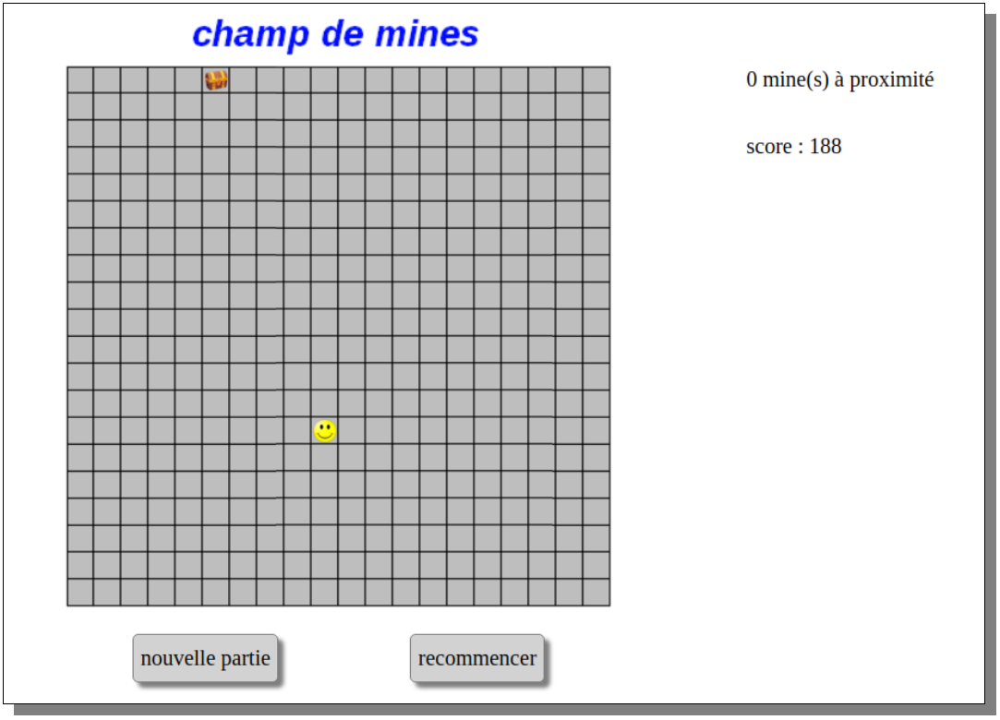
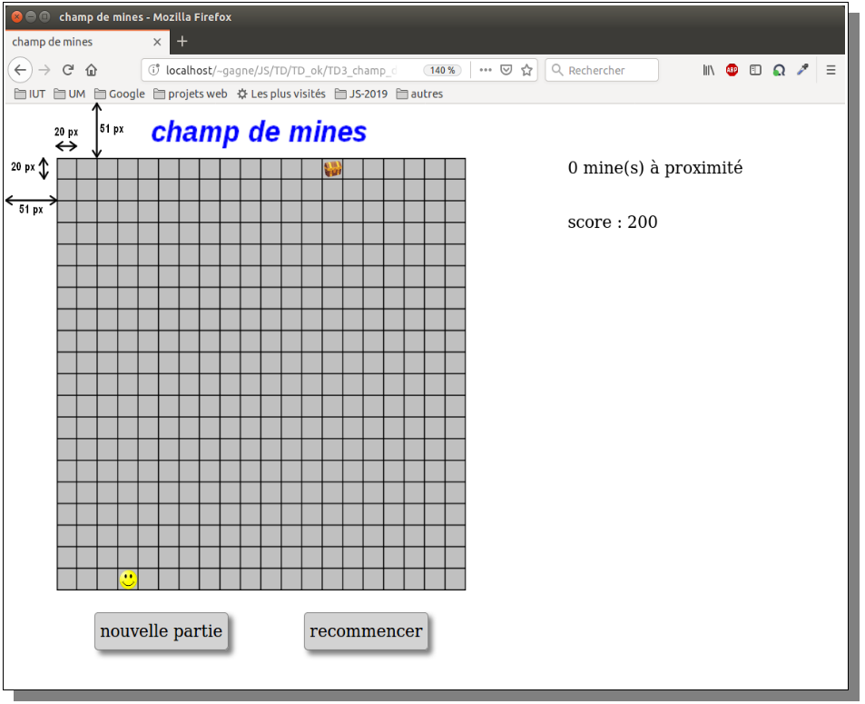

#  Prog web client riche - JavaScript

### IUT Montpellier-Sète – Département Informatique

## TD3
#### _Thème : objets, classes, gestion d'événements par des écouteurs_

Cliquez sur le lien ci-dessous pour faire, dans un dossier public_html/JS/TD3, votre fork privé du TD3 (**attention, pas de fork à la main !**):

https://classroom.github.com/a/Ubp0J3WQ

## INTRODUCTION

L’objectif de ce TD est de développer un jeu de champ de mines, où un personnage (représenté par un smiley) doit se déplacer sur un carré de 20 lignes et 20 colonnes pour atteindre un trésor (représenté par un coffre), en évitant un certain nombre de mines qui auront été déposées aléatoirement sur le terrain.
Le personnage peut se déplacer avec les touches haut, bas, gauche et droite sur le terrain. Il ne peut pas en sortir.
Il est initialement placé sur une case aléatoire de la ligne du bas et le trésor est placé sur une case aléatoire de la ligne du haut. Il commence la partie avec un score de 200 points. Ce score est dégressif : chaque pas lui fait perdre un point.

À tout moment, il sera prévenu du nombre de mines qu’il a à proximité immédiate (à sa gauche, droite, devant ou derrière lui, mais pas celles placées en diagonale, inaccessibles en un pas).

<p align="center">
   
</p>

S’il arrive au trésor, ou s’il marche sur une mine, un message donne l’information et le jeu est arrêté.

Les fichiers `jeu.html` et `jeu.css` constituent une base de travail, ainsi que les images fournies. Vous testerez, dans la console, les méthodes que vous coderez.

## Exercice 1 - La classe `Element`

Vous utiliserez dans ce TD des objets des classes `Personnage`, `Tresor` et `Mine`. Ces trois classes héritent d'une classe `Element` qui regroupe les attributs et méthodes en commun.
Il n’y aura donc pas d’objet `Element` proprement dit, mais un `Personnage`, un `Tresor` et des `Mine`.

On définit un `Element` par les attributs suivants :

- 0 &le; `ligne` < 20, qui représente le numéro de la ligne de l’élément dans le terrain. Partons du principe que `ligne = 0` correspond à la ligne du haut (celle du trésor) et `ligne = 19` correspond à la ligne du bas (celle du départ du personnage).
- 0 &le; `colonne` < 20, nombre qui représente le numéro de la colonne de l'élément. La colonne de gauche est `colonne = 0`.
- `spriteElement`, qui correspond à une balise `` qui permettra d'afficher une image pour l'élément.

On prévoit les méthodes suivantes :

+ `constructor(ligne, colonne, spriteURL)` qui 
  1. recopie `ligne` et `colonne` ;
  1. stocke dans `spriteElement` une balise `` (que vous créerez avec une méthode du [Cours 2](https://github.com/IUTInfoMontp-M4103C/Cours/raw/master/ressources/pdf/Cours2-JS-2020.pdf))<!-- `createElement` -->, qui aura la classe CSS `element` et dont l'adresse de l'image sera `spriteURL` (quel attribut de `` utiliser ?)<!-- `src` --> ;
  1. appelle la future méthode `placer(ligne, colonne)`.  

    **Remarque :** La balise n'est pas insérée dans la page Web et donc ne s'affiche pas pour l'instant.

+ `placer(ligne, colonne)` qui met à jour les attributs `ligne` et `colonne`, et positionne le `spriteElement` en ajustant son `top` et son `left`.
  Il faudra donc modifier la valeur de `this.spriteElement.style.top` et de `this.spriteElement.style.left`, par exemple `this.spriteElement.style.top=13px`. Chaque case de l’image de fond est un carré de `20px` de côté et le quadrillage est décalé de `51px` des bords de l’écran, comme indiqué ci-dessous. Le mode de calcul sera à mettre en place.

  **Rappel :** Si vous vous souvenez du [cours de HTML/CSS](https://romainlebreton.github.io/ProgWeb-HTMLCSS/tutorials/tutorial3.html#position), on peut positionner l'image par rapport à son père (l'image de la grille) en mettant l'image en `position:absolute`, et le père en `position:relative`. Nous l'avons déjà fait pour vous dans le CSS `jeu.css`.
 
 <p align="center">
    
 </p>

+ `afficher()` qui affiche `spriteElement` en le rajoutant dans la balise `<div id="champ">`.
+ `cacher()` qui cache `spriteElement` en le supprimant dans la balise `<div id="champ">`.

1. Écrivez la classe `Element` en complétant le fichier `element.js`.

Vous savez qu’il n’y aura pas d’objet `Element` proprement dit, mais pour vérifier la justesse de votre code, vous pouvez en console tester les commandes suivantes :

```js
let personnage = new Element(19, 12, 'img/personnage.png');
personnage.afficher();
personnage.placer(5, 5);
personnage.cacher();

let tresor = new Element(0, 3, 'img/tresor.png');
tresor.afficher();
```

## Exercice 2 - Les classes `Tresor`, `Mine` et `Personnage`

Un trésor est un objet très simple qui n’est pas amené à se déplacer. Il n'a qu'un `constructor(colonne)` qui construit le trésor en invoquant le constructeur de la classe `Element` (avec `super(...)`), sachant que le trésor est sur la ligne du haut et que son image se trouve à l'adresse `"img/tresor.png"`.

2. Complétez la classe `Tresor` dans le fichier `element.js`.

La classe `Mine` est très similaire à `Tresor` : le constructeur prend juste deux arguments `ligne, colonne` sachant l'image des mines se trouve à l'adresse `"img/croix.png"`.

3. Complétez la classe `Mine` dans le fichier `element.js`.

La classe `Personnage` possède un attribut propre `score`. Voici ses méthodes :

   * `constructor(colonne)` fonctionne comme pour `Tresor` mais sur la dernière ligne. Il faut aussi initialiser `score` à 200.
   * `deplacer(dl, dc)` déplace le personnage de `dl` lignes et `dc` colonnes si le déplacement est possible (attention aux bords). Le score du joueur est décrémenté de 1 si un mouvement est réellement exécuté.
   * `majSprite(nbMinesVoisines)` met à jour le `spriteElement` (la balise ``) du personnage pour afficher l'image alternative `"img/personnage2.png"` si il y a une mine dans une case voisine.

4. Écrivez la classe `Personnage` en la rajoutant à la fin du fichier `element.js`.

Voici un exemple de code pour tester vos implémentations.

```js
let tresor = new Tresor(7);
tresor.afficher();

let mine = new Mine(10, 13);
mine.afficher();

let personnage = new Personnage(2);
personnage.afficher();
personnage.deplacer(0, -1);
personnage.deplacer(0, -1);
personnage.deplacer(0, -1); // Doit rester au bord
personnage.deplacer(0, 1);
personnage.deplacer(1, 0); // Doit rester au bord
personnage.deplacer(-1, 0);
personnage.majSprite(1); // Doit afficher un personnage mécontent
personnage.majSprite(0); // Doit afficher un personnage content
```

## Exercice 3 - la classe `Jeu`

La classe `Jeu` est responsable de la gestion globale des éléments du jeu, et en particulier les interactions entre les différents éléments placés sur la grille. C'est dans cette classe que va se trouver la plus grosse partie de la logique du jeu.

Un objet de type `Jeu` dispose, entre autres, des attributs suivants :
- un `Tresor` initialisé dans le constructeur, en lui donnant une position aléatoire sur la première ligne
- un `Personnage` initialisé dans le constructeur en lui donnant une position aléatoire sur la dernière ligne
- un tableau bidimensionnel `carte` de 20 lignes ayant chacune 20 booléens indiquant la position des mines : `this.carte[i][j]` est vrai s'il y a une mine sur la case en ligne `i` et colonne `j`. Ce tableau est initialisé dans le constructeur en choisissant aléatoirement pour chaque case s'il y a ou non une mine avec une probabilité `probaMine` passée en argument du constructeur. On s'assurera également qu'il n'y a pas de mine dans les cases immédiatement adjacentes aux positions initiales du trésor et du personnage.
 
5. Écrivez le constructeur `constructor(probaMine)` de la classe `Jeu` qui doit initialiser les attributs décrits précédemment et afficher sur la page les images correspondant au trésor et au personnage.

1. Ajoutez à la classe `Jeu` les méthodes

   * `afficherMines()` : Pour afficher les mines, il faut parcourir le tableau `mines` pour déterminer la position des mines, créer des objets de type `Mine` avec la bonne position et les afficher.
   * `cacherMines()` : Il y a au moins deux façons de procéder :
     1. Soit on enlève les balises qui correspondent aux `Mine`. Il peut être judicieux de les avoir stocké dans un attribut du `Jeu` pour pouvoir les cacher facilement.
     1. Soit on vide `<div id="champ">` et on réaffiche uniquement le tresor et le personnage.

1. Ajoutez à la classe `Jeu` une méthode `nbMinesVoisines()` qui renvoie le nombre de mines se trouvant dans des cases adjacentes à la position courante du personnage.

1. Ajoutez à la classe `Jeu` les méthodes `estGagne()` et `estPerdu()` qui renvoient un booléen indiquant si la partie est respectivement gagnée (le personnage se trouve sur le trésor) ou perdue (le personnage se trouve sur une mine ou son score est &leq; 0).

## Exercice 4 - le scénario du jeu

Il reste à coder le fichier `scenario.js`, qui va faire entrer en scène les divers objets, et organiser les gestions d’événements. Ce fichier possède déjà une fonction partiellement codée, et qui va gérer les événements clavier.

Afin de pouvoir modifier le jeu à l'aide d'événements sur la page (clics ou clavier), on utilise une variable globale `jeu` dont la valeur sera l'objet de type `Jeu` de la partie en cours.

9. Complétez le code exécuté lorsque l'utilisateur appuie sur une touche du clavier (`addEventListener("keydown", ...)`) pour que le personnage se déplace lorsqu'on appuie sur les différentes touches de direction.

1. Écrivez la fonction `miseAJour()` dont le rôle est de mettre à jour les différentes informations affichées :
    - Le score du joueur affiché dans la balise d'identifiant `score`.
    - L'image représentant le personnage en fonction du nombre de mines à proximité (en utilisant la méthode écrite précédemment).
    - Le nombre de mines à proximité du joueur si la partie est encore en cours dans la balise d'identifiant `message`.
    - Si le jeu est gagné ou perdu, il faut l'indiquer dans `<div id="message">` et afficher les mines.  

  Ajoutez un appel à cette fonction à la fin de la gestion des événements clavier (pour mettre à jour les informations lorsque le personnage se déplace).

  **Remarque :** Préférez `innerText` à `innerHTML` pour écrire du texte dans une balise. Cela fait l'équivalent d'un `htmlspecialchars` de PHP.

1. Écrivez une fonction `nouvellePartie()` qui démarre une nouvelle partie. Cette fonction doit :
    - Enlever de la page tous les éléments correspondant à la partie actuelle.
    - Créer un nouvel objet de type `Jeu` et mettre à jour la variable globale `jeu`.
    - Appeler la fonction `miseAJour()` pour mettre à jour les affichages.

1. Faites en sorte qu'une nouvelle partie soit automatiquement démarrée quand la page est chargée, et que la fonction `nouvellePartie()` soit appelée lorsque l'utilisateur clique sur le lien dont l'identifiant est `nouvelle-partie`.

## Exercice 5 - Améliorations

13. Effectuez les modifications nécessaires pour qu'il ne soit plus possible de se déplacer lorsque la partie est terminée (gagnée ou perdue).

On veut maintenant ajouter une fonctionnalité supplémentaire au jeu. Lorsque l'utilisateur appuie sur la touche "A" du clavier, on veut afficher toutes les mines du terrain pendant 1 seconde avant de les cacher à nouveau. L'utilisation de cette fonctionnalité réduit le score du joueur de 50 points.

14. Effectuez les modifications nécessaires dans votre programme pour implémenter cette fonctionnalité.  
    **Bonus :** Veillez en particulier à bien gérer les éventuels problèmes qui pourraient se produire si l'utilisateur appuie plusieurs fois rapidement sur la touche "A".
