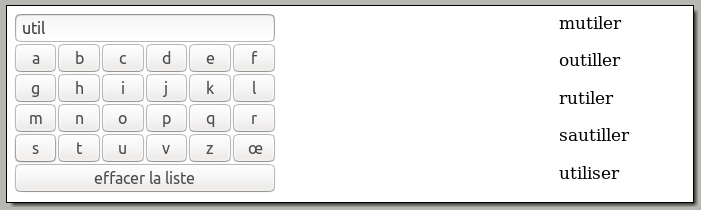
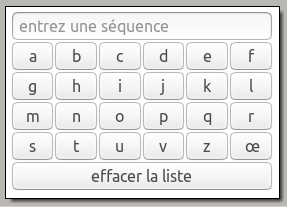

#  Prog web client riche - JavaScript

### IUT Montpellier-Sète – Département Informatique

## TD5
#### _Thème : l'objet XMLHttpRequest, requêtes AJAX_

Cliquez sur le lien ci-dessous pour faire, dans un dossier public_html/JS/TD5, votre fork privé du TD5 (**attention, pas de fork à la main !**):

https://classroom.github.com/a/4hfyrk3u

## INTRODUCTION

Dans ce TD, nous allons découvrir et manipuler un objet très important en JavaScript : l’objet **XMLHttpRequest**.

Cet objet est une interface JavaScript permettant de communiquer avec un serveur pour recueillir des données.

Il permet par exemple de lancer des requêtes sur une base de données, mais aussi, plus simplement, de recueillir des données affichées par un simple `echo` PHP.

Vous utiliserez le format `JSON`, qui offre un format très lisible et compréhensible d’échange de données, et que vous pouvez utiliser en **PHP** et en **JavaScript**. Ce format sera utilisé simplement au travers de fonctions PHP (`json_encode`) et JS (`JSON.parse`).

**Attention vous devez impérativement travailler dans votre répertoire public_html (fichiers PHP).**

## EXERCICE 1 – premier exemple simple

1. Vous disposez d'un fichier `ex1/coucou.php` dont le seul objectif est d’afficher « coucou ».

		<?php echo "coucou"; ?>

   De votre navigateur, faites une requête `http` sur la page `coucou.php` puis ouvrez la console JavaScript (F12, onglet console).

	 Entrez la commande suivante

		let xhr = new XMLHttpRequest();

   Cette commande instancie un nouvel objet JavaScript de type `XMLHttRequest`, stocké dans la variable `xhr`.

2. Cet objet sert à lancer des requêtes au serveur. Nous allons lancer, grâce à la variable `xhr`, une requête à la page `coucou.php`. Pour cela, entrez les commandes suivantes dans la console :

		xhr.readyState;					// état de xhr
		xhr.responseText;					// contenu texte de la réponse
		xhr.open("GET","url_vers_coucou.php",true);		// ouverture de la requête
		xhr.readyState;					// état de xhr
		xhr.responseText;					// contenu texte de la réponse
		xhr.send(null);					// envoi de la requête
		xhr.readyState;					// état de xhr
		xhr.responseText;					// contenu texte de la réponse

	+ l'url vers le fichier `coucou.php` est celle qui correspond à votre architecture de fichiers, par exemple `webinfo.iutmontp.univ-montp2.fr/~monlogin/JS/TD4/src/ex1/coucou.php`
	+ `readyState` donne l’état d’avancement de la requête (0 à 4). voir cours plus tard.
	+ `responseText` donne l’état actuel de la réponse textuelle à la requête
	+ la méthode `open` donne à `xhr` tous les éléments pour lancer la requête.
	+ la méthode `send` envoie la requête (le paramètre `null` vient du fait que la méthode est GET, voir plus tard dans le cours).
	+ le paramètre `true` de la méthode `open` sera détaillé dans le cours.

3. Commentez l’évolution des attributs `readystate` et `responseText`.

## EXERCICE 2 – Utilisation de json_encode (PHP) et de JSON.parse (JS)

1. Examinez le contenu du fichier `src/ex2/haddock_v1.php` puis appelez-le dans le navigateur. Vérifiez qu'à l'affichage, vous obtenez bien une chaîne de caractères correspondant à un tableau équivalent à celui stocké dans la variable `$haddock`.

2. Comme dans le premier exemple, créez un objet `XMLHttpRequest` puis lancez les commandes suivantes :

		let xhr = new XMLHttpRequest();		
		xhr.open("GET","votre url vers haddock_v1.php",true);
		xhr.send(null);
		xhr.readyState;
		xhr.responseText;
		let resultat = xhr.responseText;
		resultat;
		let tab = JSON.parse(resultat);
		tab;
		tab.length;
		tab[0];
		tab[1];
		tab[4];

   Vous devez voir en console un tableau JavaScript dont on peut facilement récupérer les éléments, pour une utilisation ultérieure (par exemple un affichage dans une page html).

## EXERCICE 3 – Utilisation de json_encode (PHP) et de JSON.parse (JS)

1. Examinez le contenu du fichier `src/ex3/haddock_v2.php` puis appelez-le dans le navigateur. Vérifiez qu'à l'affichage, vous obtenez bien une chaîne de caractères correspondant à un objet équivalent à celui stocké dans la variable `$haddock`.

2. comme dans l'exercice précédent, créez un objet `XMLHttpRequest` puis lancez les commandes suivantes :

		let xhr = new XMLHttpRequest();		
		xhr.open("GET","votre url vers haddock_v2.php",true);
		xhr.send(null);
		xhr.readyState;
		xhr.responseText;
		let resultat = xhr.responseText;
		resultat;
		let obj = JSON.parse(resultat);
		obj;
		obj.nom;
		obj.prenom;
		obj.coordonnees;
		obj.coordonnees.email;

   Vous devez voir en console un objet JavaScript dont on peut facilement récupérer les attributs, pour une utilisation ultérieure.

## EXERCICE 4 – chargement long d’un fichier texte

Il peut arriver que le chargement des données à recueillir soit assez long. Dans ce cas l’attribut `readystate` ne passe pas immédiatement à la valeur 4.

L’événement `load` traduit la fin du chargement des données.

On va donc mettre l’objet `xhr` en état d’écoute de cet événement.

Voici les commandes :

		let xhr = new XMLHttpRequest();		
		xhr.open("GET","un_certain_fichier.txt",true);
		xhr.addEventListener("load",function() {
			console.log("chargement terminé !!!");
		});
		xhr.send(null);

et une fois que le message "chargement terminé !!!" s'affiche :

		xhr.responseText.length;

remarque : évitez d’afficher directement dans la console la variable texte. Sa taille importante peut faire planter le navigateur...

### Détails :

- on crée un objet `XMLHttpRequest`;
- on lui donne les éléments pour lancer la requête;
- on le met en écoute de l’événement `load`, et quand cet événement se produit, on lance une fonction anonyme qui affiche dans la console « chargement terminé »;
- on lance la requête par send;

Cette fonction lancée après la fin du chargement est habituellement appelée fonction **callback**.

Vous allez mettre en œuvre ces commandes en chargeant divers fichiers txt de tailles variées (voir ces fichiers dans le dossier `src/ex4`) :

+ mobydick.txt (environ 1,2 Mo)
+ bible.txt (environ 4,4 Mo)
+ bible2.txt (environ 45 Mo) obtenue par recopie du précédent

voyez-vous un délai pour le lancement de la fonction **callback** ?

## EXERCICE 5 - Chargement à partir d'une table de données

Jusqu'à présent, la programmation PHP serveur permettait un echo basique (simple phrase) ou plus évolué (encodage JSON d'une structure complexe, comme un tableau ou un objet PHP).

Dans cet exercice, il y aura une requête sur une base de données, avec production d'un tableau résultat, puis utilisation de ce tableau par JavaScript.

Le contexte :

+ vous disposez d'une table de données, que vous pouvez importer sur votre base de données par le fichier `ressources/verbes.sql`. Cette table contient environ 4800 verbes de la langue française.
+ Vous devrez mettre en place une interface de sélection des verbes, et un `
` d'affichage des verbes sélectionnés. La sélection se fera soit en cliquant sur un bouton (qui fera apparaître tous les verbes qui commencent par la lettre en question), soit en changeant la valeur du champ texte (qui fera apparaître tous les verbes qui contiennent la séquence de caractères tapée).

Voici un exemple avec utilisation du champ de recherche

   

**1. création de l'interface**

Vous devez compléter, dans le fichier `js/scripts.js`, le code de la fonction `creer_interface` qui remplira la `
` de façon à avoir les `input` suivants :

   

Cette interface sera automatiquement créée au chargement du `<body>`. Ceci se fera au moyen de l'instruction qui est pour le moment commentée et qu'il faudra activer :

	document.body.onload = creer_interface;

Les clics sur les divers boutons et les changements sur le champ de recherche seront gérés plus tard.

- L'`input` de recherche est un `<input type="text" placeholder="entrez une séquence">`;
- Les `input` représentant les lettres sont des `<input type="button" value="a">` avec une `value` personnalisée;
- L'`input` pour effacer est un `<input type="button" value="effacer la liste">`;

**2. la fonction charger_verbes**

Cette fonction prend en charge deux paramètres, `lettre` et `type`. Elle doit :
+ créer une variable `url` qui correspond à l'adresse du fichier `recherche.php` à qui on passe, en `GET`, les variables `lettre` et `type` dont les valeurs sont données en paramètres de la fonction;
+ lancer la méthode `open` de la variable globale `xhr`, en méthode `GET`, à l'url précédente, avec le paramètre `true`;
+ mettre `xhr` en état d'écoute de l'événement `load`, avec comme fonction de traitement **_asynchrone_** la fonction `callback_basique`, dont le seul effet sera d'afficher le `JSON.parse(xhr.responseText)` dans la console, sans le moindre traitement esthétique.
+ envoyer la requête grâce à la méthode `send` de `xhr`;

Testez ensuite votre fonction dans la console, par exemple par des instructions comme :
- `charger_verbes('a','init');`
- `charger_verbes('c','init');`
- `charger_verbes('term','seq');`

Enfin, faites en sorte de modifier la fonction `creer_interface` pour que :
+ un clic sur un bouton de type lettre lance `charger_verbes` avec comme paramètres la valeur de la lettre et le type 'init' (comme initiale);
+ un changement dans l'input de recherche lance `charger_verbes` avec comme paramètres la valeur du champ et le type 'seq' (comme séquence).

Vous pouvez passer par des écouteurs d'événements (`click` ou `input`), ou bien affecter aux attributs `onclick` et `oninput` des différents input des fonctions anonymes qui font les actions attendues. Testez les deux méthodes. 

**3. La fonction callback**

C'est elle qui est chargée, à partir de `xhr.responseText`, de remplir la `
`. On doit :
+ récupérer dans une variable xhrJSON le `JSON.parse(xhr.responseText)`;
+ réinitialiser le `innerHTML` de la `div_verbes`;
+ pour chaque élément du tableau `xhrJSON`, fabriquer un élément `
` dont le `innerHTML` sera le libellé de l'élément courant du tableau `xhrJSON`;
+ faire adopter cet élément paragraphe par `div_verbes`.

N'oubliez pas de modifier `charger_verbes` pour qu'elle appelle non plus le `callback_basique` mais ce nouveau `callback`... 

**4. le bouton "effacer la liste"**

Il reste, dans la fonction `creer_interface`, à définir ce que donnera le clic sur le bouton "effacer la liste", à savoir : réinitialiser le `innerHTML` de `div_verbes`, et effacer la valeur du champ de recherche. A vous !

**5. Encodage des URLs**

Dans la fonction `charger_verbes`, vous avez créé une URL avec *query string* à
partir de données venant de l'utilisateur. Comme nous l'avons vu en PHP, cela
pose un problème de sécurité : si l'utilisateur utilise des caractères comme
`?,=,/,&`, alors cela *casse* l'URL, c'est-à-dire que cela en change le sens.

Pour parer à cela, nous allons comme en PHP échapper les caractères spéciaux des
URLs. L'équivalent de la fonction PHP `rawurlencode` est la fonction JS
[`encodeURIComponent`](https://developer.mozilla.org/fr/docs/Web/JavaScript/Reference/Global_Objects/encodeURIComponent). Attention,
il ne faut pas l'appliquer à toute l'URL, mais juste aux bouts dont on veut
échapper les caractères spéciaux.

Pour tester que votre code est maintenant sécurisé, rajoutez des mots avec des
caractères spéciaux `?,=,/,&` dans votre base de données `verbes` et vérifiez qu'ils apparaissent bien quand vous tapez leur début. Par exemple, rajoutez `a&e?bla` dans la BDD et tapez `a&e?b` dans l'`input` de recherche.

**6. Requête `POST`**

Changez votre requête JS pour faire une requête `POST` et mettez à jour la façon
de passer les paramètres de la requête pour faire comme les formulaires `POST` (cf le Cours).
