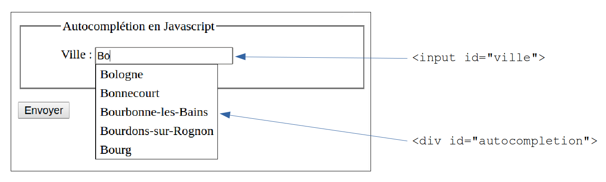
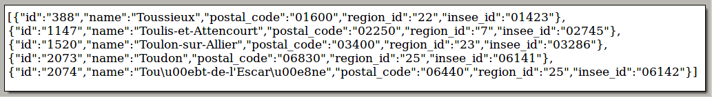
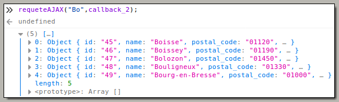
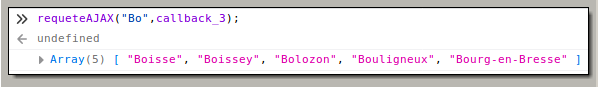

#  Prog web client riche - JavaScript

### IUT Montpellier-Sète – Département Informatique

## TD6
#### _Thème : asynchronisme en JavaScript, AJAX, formulaire autocomplétif_

Cliquez sur le lien ci-dessous pour faire, dans un dossier public_html/JS/TD6, votre fork privé du TD6 (**attention, pas de fork à la main !**):

https://classroom.github.com/a/Z4VgoNB4

## Introduction

Dans ce TD6, on reprend l’aspect asynchrone de JavaScript (abordé au TD5), qui permettra de modifier le contenu d’un élément d’autocomplétion, représenté par la balise html `<div id="autocompletion">`, à chaque modification du champ de saisie `<input id="ville">`.

Cet élément `<div id="autocompletion">` fournira alors une liste de villes dont le nom commence par les lettres insérées dans `<input id="ville">`.

Voir ci-dessous :

<p align="center">
   
</p>

Le contenu de cet élément `<div id="autocompletion">` est alimenté par le résultat (après traitement) d’une requête de type **AJAX** sur une base de données.

<!-- La fin du TD est consacrée à une fonctionnalité d’actualisation de l’élément `<select id="pays">` (sélecteur du pays) par changement de l’autre élément `<select id="continent">` (sélection du continent), ainsi qu'à diverses fonctionnalités complémentaires liées à la balise `<input id="ville">`. -->

<!-- Contrairement à la liste de villes (plus de 36000 entrées, ce qui justifie le stockage sur base de données), la liste de pays par continent est de taille raisonnable et sera gérée en local par JavaScript, par un fichier `countries.js` qui affecte une variable globale `countries`.   -->

Vous mettrez en place le contexte web dans votre `public_html/JS/TD6` avec les fichiers du dossier `src`.

Le fichier `js/scripts.js` est à construire complètement.

## Exercice 1 – Ébauche du fichier `scripts.js`

1. Dans le fichier `scripts.js`, codez la fonction `afficheVilles` qui prend en paramètre un tableau de villes comme `["Bordeaux","Toulouse","Montpellier","Nice"]` et remplit la `<div id="autocompletion">` avec un paragraphe par nom de villes comme ci-dessous

   ```html
   <div id="autocompletion">
     <p>Bordeaux</p>
     <p>Toulouse</p>
	 <p>Montpellier</p>
     <p>Nice</p>
   </div>
	```

   Votre code utilisera obligatoirement la méthode `appendChild` pour chaque `<p>` à créer. Insérez votre fichier `scripts.js` dans le `html`, puis testez votre fonction avec le tableau ci-dessus en le déclarant dans une variable `tableau` et en lançant `afficheVilles(tableau)` dans la console;

	```js
	let tableau = ["Bordeaux","Toulouse","Montpellier","Nice"];
	afficheVilles(tableau);
	```

   Faites un deuxième appel de la fonction avec le même tableau. Vous devez constater qu’il peut être malin de commencer par vider le contenu de la balise `<div id="autocompletion">`. C'est ce que nous allons faire dans la question suivante.


2. Créez une fonction `videVilles` qui vide l’élément `<div id="autocompletion">`. Cette fonction sera appelée par `afficheVilles`. Vous utiliserez deux approches différentes :

	- une méthode qui utilise `removeChild`,
	- une méthode plus basique qui remet le `innerHTML` de `<div id="autocompletion">` à `""`.

   Remarque : on ne dit pas que les méthodes `appendChild` et `removeChild` sont meilleures qu’un "bricolage" du `innerHTML`, par contre elles sont plus dans la logique objet, et seront plus simples à utiliser si l’arborescence à ajouter/modifier se complique. Notre arborescence de `<p>` reste ici simple.

## Exercice 2 – La page de requête `requeteVille.php`

Cette page côté serveur est déjà codée pour vous permettre de lancer une requête de type `SELECT` sur la base de données. Elle incorpore un fichier `Model.php` qui incorpore lui-même un fichier `Conf.php`. Ce fichier `Model.php` vous propose une méthode `static selectByName` qui permettra de récupérer les 5 premières villes dont le nom commence comme la chaîne de caractères passée en paramètre à cette méthode (voir le code).

Les deux classes `Conf` et `Model` ont été abordées au S3 et vous n’avez pas à y toucher (sauf si vous voulez changer les paramètres de connexion pour utiliser votre propre base de données, avec le fichier [`cities.sql`](https://seafile.lirmm.fr/f/2f5336dac874454bbb31/?dl=1)).

Vous n’interviendrez que sur quelques lignes du fichier `requeteVille.php`.

Ce fichier sera exécuté au moyen d’url du type `requeteVille.php?ville=Bo`

Le paramètre `ville` permettra d’utiliser `selectByName($name)`, avec la bonne valeur pour le paramètre `$name`. Par exemple, l’url `http://webinfo.iutmontp.univ-montp2.fr/~monlogin/JS/td6-moi/src/php/requeteVille.php?ville=Bo` permettra de lancer, par la fonction `selectByName`, la requête `SQL` suivante :

```sql
SELECT * FROM cities WHERE name LIKE 'Bo%' LIMIT 5
```

1. Complétez la page `requeteVille.php` pour qu’elle suive les étapes suivantes :

+ extraire la ville passée en `GET` dans l’url ;

+ appeler la fonction `selectByName` déjà codée et stocker le résultat dans une variable `$tab` ;

+ produire un `echo json_encode` de cette variable. L’affichage produit se fera donc en format `JSON` facilement exploitable par JavaScript.

2. Testez ensuite le bon fonctionnement de la page en appelant des url du type `requeteVille.php?ville=Mo` ou `requeteVille.php?ville=Tou`. Vous devez voir dans le navigateur un affichage brut du résultat de la requête SQL.


<p align="center">
   
</p>


<p align="center">
   <i>résultat de la requête <strong>requeteVille.php?ville=Tou</strong></i>
</p>

## Exercice 3 – Requête asynchrone

### Un peu de technique

Comme au TD4, nous allons utiliser un objet `XMLHttpRequest` qui permet de lancer des requêtes HTTP de manière asynchrone, c’est-à-dire sans bloquer la page web courante.

L’ensemble des technologies autour des pages web asynchrones s’appelle `AJAX` (_Asynchronous Javascript And Xml_).

Voici le squelette d’une requête `AJAX` :

```js
function requeteAJAX(stringVille) {
  let url = "php/requeteVille.php?ville=" + encodeURIComponent(stringVille);
  let requete = new XMLHttpRequest();
  requete.open("GET", url, true);
  requete.addEventListener("load", function () {
    console.log(requete);
  });
  requete.send(null);
}
```

Rappels sur la fonction `requeteAJAX` :

+ gère un paramètre `stringVille` qui est une chaîne de caractères (ce sera celle qu’on écrira dans la balise `<input id="ville">`);
+ crée une url pour `requeteVille.php`, construite à partir du paramètre `stringVille`. On traite `stringVille` pour gérer les caractères spéciaux des URL avec [encodeURIComponent](https://developer.mozilla.org/fr/docs/Web/JavaScript/Reference/Global_Objects/encodeURIComponent);
+ crée un objet `XMLHttpRequest` nommé `requete`;
+ ouvre cette requête avec la méthode `open` qui donne le type de requête HTTP à effectuer (ici `GET`), l’URL de la page demandée et le troisième argument (`true`) signifie que la requête doit être asynchrone.
+ met cet objet `requete` en écoute de l’événement `load`, ce qui signifie que l’objet `requete` attendra la fin du chargement des données commandées à la base de données, pour lancer la fonction déclarée de manière anonyme et dont la modeste mission est ici d’afficher l’objet `requete` dans la console.
+ lance la requête par la méthode `send`. Le paramètre `null` est lié au fait que la méthode est `GET`. Si c’était `POST`, on aurait comme paramètre une chaîne de caractères annonçant les paires «`nom=valeur`», c’est-à-dire ici «`ville=…`» (cf. la [documentation MDN de send](https://developer.mozilla.org/fr/docs/Web/API/XMLHttpRequest/send)).


Le principe d’une requête asynchrone est qu’elle ne bloque pas l’exécution du JavaScript le temps que le serveur renvoie sa réponse.

La fonction anonyme, qui ne fait qu’afficher l’objet `requete` dans la console, est appelée fonction **callback**. Elle sera appelée lorsque le serveur aura retourné ses informations.

Elle a pour mission **le traitement de la réponse du serveur**. Bien entendu, au final, cette fonction _callback_ aura pour mission de remplir le contenu de la balise `<div id="autocompletion">`.

C’est ce que nous allons structurer, en plusieurs étapes. Comme nous allons construire plusieurs versions de la fonction `callback`, nous allons plutôt utiliser ce code plus générique :

```js
function requeteAJAX(stringVille,callback) {
	let url = "php/requeteVille.php?ville=" + encodeURIComponent(stringVille);
	let requete = new XMLHttpRequest();
	requete.open("GET", url, true);
	requete.addEventListener("load", function () {
		callback(requete);
	});
	requete.send(null);
}
```

Dans cette version de `requeteAJAX`, on passera en deuxième paramètre le nom de la fonction qu’on aura choisie pour jouer le rôle du callback. Ainsi, pour avoir l’équivalent du premier code, on pourrait avoir définir une fonction `callback_1` de la façon suivante :

```js
function callback_1(req) {
	console.log(req);
}
```

Et on pourrait utiliser par exemple un appel `requeteAJAX("Bo",callback_1);`

### Écriture de quelques versions du callback

1. Complétez votre fichier `scripts.js` avec le code des deux cadres précédents. 

<!-- Placez la ligne d’insertion du script dans le `head` de la page. -->

<!--    Nouveauté : ajoutez l’attribut `defer` à `<script>` pour que le chargement du JS ne bloque pas la construction du DOM. Ceci revient à placer l’insertion du fichier avant la fin du `body`. La ligne d’insertion sera donc : -->

<!-- 	```html -->
<!-- 	<script type="text/javascript" src="js/scripts.js" defer></script> -->
<!-- 	``` -->

2. Rechargez la page `src/completion.html` et lancez dans la console la commande `requeteAJAX("Bo",callback_1);`. Vous devez voir dans la console un descriptif complet de l’objet `requete`, avec notamment son attribut `responseText`.

3. Lancez d’autres commandes similaires en changeant le premier argument.

4. Écrivez une fonction `callback_2` qui, au lieu d’afficher dans la console l’objet XHR, comme le faisait `callback_1`, affichera un `JSON.parse` de son attribut `responseText`. Quel est l’effet de `JSON.parse` ?

5. Testez ce `callback_2` en console avec la commande `requeteAJAX("Bo",callback_2);`

   Vous devriez obtenir un résultat comme ci-dessous

<p align="center">
   
</p>

6. Créez une fonction `callback_3` qui transforme encore le résultat précédent pour créer un tableau contenant l’attribut `name` de chacun des objets. Ainsi, quand on lance la commande `requeteAJAX("Bo",callback_3)` on doit obtenir dans la console :

<p align="center">
   
</p>


7. Créez enfin le callback final `callback_4` qui produit le même tableau que `callback_3`, et qui affiche son contenu (par l’intermédiaire de la fonction `afficheVilles`) dans la balise `<div id="autocompletion">`.

8. Testez votre fonction `callback_4` en appelant `requeteAJAX` à partir de la console avec des chaînes de caractères diverses en premier paramètre.

9. Puisque `callback_4` est satisfaisante, c'est elle que nous adoptons. Créez maintenant, toujours dans le fichier `scripts.js`, une fonction `maRequeteAJAX` qui prend en paramètre une chaîne de caractères. Grâce à cette fonction, l’instruction `maRequeteAJAX("Toul")` sera exactement équivalente à l’instruction `requeteAJAX("Toul",callback_4)`.


## Exercice 4 – Premiers gestionnaires d’événements


1. Munissez le champ `<input id="ville">` d’un écouteur d’événement, associé à l’événement `input` (qui est lancé à chaque modification du contenu d’un `<input>`). La fonction appelée sera déclarée de façon anonyme, et son action sera d’appeler la fonction `maRequeteAJAX`, avec comme paramètre la valeur de la balise `<input id="ville">`.

   Ainsi, chaque modification de ce champ met à jour le contenu de la balise `<div id="autocompletion">`. On y est presque…

2. Munissez la balise `<div id="autocompletion">` d’un écouteur d’événement, associé à l’événement `click`. Le clic sur un des paragraphes enfants de la balise aura le comportement intuitif attendu :

	- remplir `<input id="ville">` avec le contenu du paragraphe cliqué;
	- vider `<div id="autocompletion">`

   Pour cela vous utiliserez `event.target` qui permet de savoir quel paragraphe est la cible de l’événement `click`.

	A ce stade votre champ d’autocomplétion est opérationnel.


<!-- ## Exercice 5 – Les deux sélecteurs -->


<!-- Les deux sélecteurs `<select id="continent">` et `<select id="pays">` vont fonctionner indépendamment du champ d’autocomplétion. Le sélecteur de continents sera chargé dès le début, et le contenu du sélecteur de pays devra s’actualiser au changement de la valeur du sélecteur de continents. La liste des pays et des continents auxquels ils appartiennent se trouve dans le fichier `countries.js` (qui est déjà chargé par `completion.html`). -->


<!-- ### Le sélecteur de continents -->


<!-- <\!-- 1. Insérez, au niveau du `head` de `completion.html`, le fichier `countries.js` qui permet d’accéder à la variable `countries`. Attention d’insérer ce fichier avant le précédent. Réutilisez l’attribut `defer`. -\-> -->

<!-- 1. Créez, dans `scripts.js`, une fonction `chargerSelecteurContinents` basée sur `appendChild` et qui permet de structurer le sélecteur de continents en lui ajoutant des enfants `<option>...</option>`. Chacun de ces enfants aura pour `innerHTML` l’une des clés qu’on obtient par la méthode `Object.keys` appliquée à `countries`. -->

<!--    Vous aurez donc à utiliser le contenu de `Object.keys(countries)`. -->

<!--    Vous ajouterez un enfant de la forme `<option selected disabled>choisissez un continent</option>`. Il faudra pour cela agir sur les attributs `selected` et `disabled` de l’élément créé (les mettre à la valeur `true`). -->

<!--    Testez cette fonction dans la console et vérifiez que le sélecteur de continents se remplit bien. -->

<!-- 3. Faites en sorte que ce sélecteur se remplisse au chargement de la page.  -->

<!-- <\!-- Pour cela, votre fonction `chargerSelecteurContinents` sera associée à l’événement `DOMContentLoaded` dans un écouteur d’événement de l’objet `document`. -\-> -->

<!-- ### Le sélecteur de pays -->


<!-- 4. Lors d’un changement de valeur du sélecteur de continents, le sélecteur de pays doit proposer les pays du continent sélectionné. -->

<!--    Créez, dans `scripts.js`, une fonction `chargerSelecteurPays` qui permet de construire les fils de la balise `<select id="pays">` : -->

<!-- 	+ récupérer la valeur du sélecteur de continents ; -->
<!-- 	+ récupérer, dans `countries`, le tableau correspondant à cette valeur ; -->
<!-- 	+ créer, pour chaque entrée du tableau, une ligne du sélecteur de pays au moyen de la méthode `appendChild` (assez similaire au sélecteur de continents). -->
<!-- 	+ ne pas oublier la ligne `<option selected disabled>choisissez un pays</option>` -->

<!-- 5. Testez votre fonction dans la console. Vous ferez bien attention au fait que le sélecteur de pays doit être réinitialisé à chaque fois. -->

<!-- 6. Munissez le sélecteur de continents d’un écouteur d’événement pour que chaque changement de ce sélecteur lance la fonction `chargerSelecteurPays`. -->


## Exercice 5 – Améliorations diverses

### Détail css

Vous corrigerez un petit détail : Il y a un petit carré gris qui apparaît quand `<div id="autocompletion">` est vide. C’est sa `border,` de largeur `1px`. Faites en sorte de corriger, au niveau du JavaScript, l’attribut `style.borderWidth` de cette `div` en fonction de son contenu, pour ne pas avoir ce défaut du petit carré gris.


### Limitation de l’autocomplétion

Modifiez légèrement la fonction associée à l’événement `input` pour que l’auto-complétion n’opère que si le contenu du champ `Ville` contient au moins deux caractères.


### Signal de chargement

Lorsqu’un chargement est en cours, nous pouvons le signaler à l’utilisateur pour qu’il patiente le temps nécessaire. Dans notre cas, nous afficherons le GIF de chargement `loading.gif` fourni dans l’archive .zip pendant le délai de réponse du serveur.

1. Modifiez `requeteAJAX` pour que la fonction prenne en paramètres supplémentaires deux fonctions `startLoadingAction` et `endLoadingAction`.

   + La première fonction sera exécutée dès le lancement de la requête.

   + La deuxième sera exécutée dès la réception de la réponse. On aura donc des appels de la forme

		```js
		requeteAJAX("Bo",callback,action_debut,action_fin)
		```


2. Dans la fonction `maRequeteAJAX`, modifiez l’appel à `requeteAJAX` pour ajouter deux nouveaux paramètres : ce seront deux fonctions déclarées en fonctions anonymes :

	+ la première, qui jouera le rôle de `startLoadingAction`, rendra visible le GIF de chargement ;
	+ la deuxième, qui jouera le rôle de `endLoadingAction`, lui redonnera une visibilité `hidden`.

3. Pour que le comportement soit visible, truquez en ajoutant une temporisation de 1 seconde dans `requeteVille.php`

   Note : l’instruction PHP : `sleep(1);`
   
### Debouncing (Limitation de fréquence) sur la saisie

**Exercice :** Faire en sorte qu'il faut que l'on ait fini de taper depuis 200ms avant de lancer la requête.

Plus précisément, nous ne souhaitons pas envoyer de requête d'autocomplétion tant
que l'utilisateur est en train de taper. Donc tant que 2 appuis de touche sont
espacés de &lt; 200ms, il ne faut pas lancer la requête.

En pratique, vous devrez utiliser
[`setTimeout`](https://developer.mozilla.org/fr/docs/Web/API/WindowOrWorkerGlobalScope/setTimeout)
comme minuteur. Vous aurez besoin de remettre le minuteur à zéro avec
[`clearTimeout`](https://developer.mozilla.org/en-US/docs/Web/API/WindowOrWorkerGlobalScope/clearTimeout). Et
vous devrez sûrement mettre en place une manière de savoir si un minuteur est
déjà en cours.

### Debouncing sur les requêtes

**Exercice :** Faire en sorte qu'il n'y ait toujours qu'une requête en cours.

En effet, il y a un délai pour recevoir les suggestions d'autocomplétion et nous
ne voudrions pas recevoir et afficher les suggestions d'une entrée qui a changé
en temps.

Du coup, avant chaque nouvel envoi de requête, vous devez annuler la requête
précédente si elle n'a pas encore terminé (cf [la documentation MDN de la
méthode
`abort`](https://developer.mozilla.org/en-US/docs/Web/API/XMLHttpRequest/abort)
et celle de
[`readyState`](https://developer.mozilla.org/fr/docs/Web/API/XMLHttpRequest/readyState)).

<!-- https://davidwalsh.name/javascript-debounce-function -->
<!-- Écrire une fonction debounce qui prend en entrée un fonction, ... -->
<!-- // Returns a function, that, as long as it continues to be invoked, will not -->
<!-- // be triggered. The function will be called after it stops being called for -->
<!-- // N milliseconds. If `immediate` is passed, trigger the function on the -->
<!-- // leading edge, instead of the trailing. -->
<!-- function debounce(func, wait, immediate) { -->

<!-- Throttling  -->
<!-- https://codeburst.io/throttling-and-debouncing-in-javascript-b01cad5c8edf -->
<!-- Contient aussi des use case -->


### Utilisation de services Web externes

Il existe une multitude de services Web qui permettent d'obtenir des données en appelant une
URL spécifique. Nous vous proposons d'aller récupérer la météo de la ville
saisie à l'aide de l'API https://openweathermap.org/api

1. Inscrivez-vous gratuitement sur le site pour obtenir une clé d'API.

2. Lisez la [documentation de l'API](https://openweathermap.org/current#name) pour obtenir la météo d'une ville. Affichez la description de la météo sur votre page. La description est en anglais par défaut, mais il existe un paramètre à mettre dans l'URL pour lui dire de le mettre en français (regardez la doc).

<!-- Units, Lang=FR -->

3. On peut trouver des icônes correspondants aux météos (cf la [documentation sur la liste des codes météorologiques](https://openweathermap.org/current#list)). Affichez sur votre page une icône correspondant à la météo.

4. Faites en sorte que l'affichage de la météo se déclenche quand on clique sur
   une suggestion d'auto-complétion.


<!-- https://api.openweathermap.org/data/2.5/weather?q=${meteoInputElement.value}&appid=xxx&lang=FR -->
<!-- https://openweathermap.org/img/wn/10d.png -->

### Utilisation des touches ↓ , ↑ et ↵

Les touches haut et bas servent habituellement à se déplacer dans la liste des suggestions, et la touche `ENTER` à valider l’élément courant. L’utilisation de ces touches entraîne une mise à jour du champ texte où s’inscrit le nom de la ville. Programmez ces comportements.

### Bonus : debouncing automatisé

Nous allons automatiser la fonctionnalité de la section "Debouncing sur la
saisie". Vous devez écrire une fonction `debounce(callback, timeout)` qui prend
en argument une fonction `callback` et un nombre `timeout`, et renvoie une
fonction `callback_debounced`. Le but est que votre ancien code puisse être remplacé par :

```js
document.getElementById("ville").addEventListener("input", debounce(callback,200));
```
